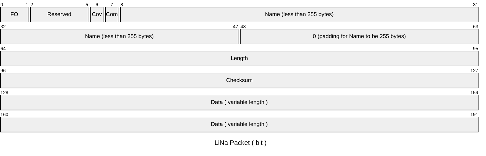
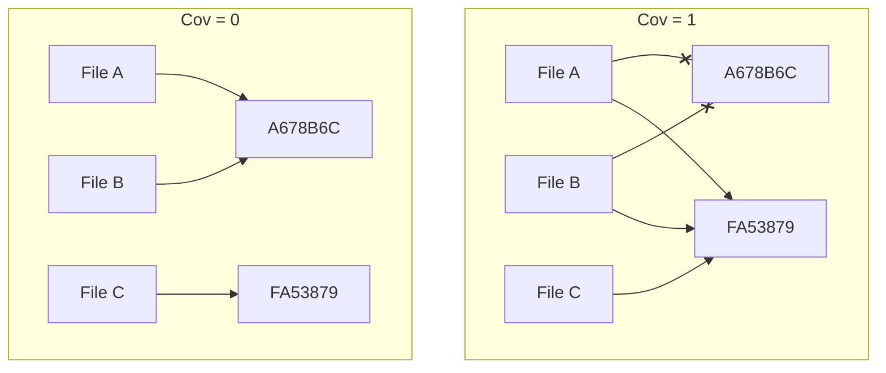

# ⭐ LiNa Store
A tiny ( less than 5 mb ), low-cost file storage service for linux.

## Features
### LiNa Store provides two applications:

- `linastore`: A simple local file storage service, which can deduplicate files and store them in a local directory. It can also support compression.

- `linastore-server`: The online version of LiNa Store. It accepts requests from two protocols: `HTTP` and `LiNa protocol`.

## Manual
### 1. Compile

LiNa Store offer a simple way to compile, you just need to run the following command:
```bash
git clone https://github.com/debugdoctor/linastore.git
cd linastore
cargo build --release
```
and then the binary file will be generated in `target/release`.

### 2. Send stream to LiNa Store server
LiNa protocol is a simple protocol, you can use any socket client to send stream to LiNa Store server.

The structure of LiNa protocol is as follows:


and the first byte of LiNa packet is called "Flags", the specific meaning of each bit is as follows:

**2.1 File Operation Flags (`FO`)**

| Binary | Operation | Description                     |
|--------|-----------|---------------------------------|
| `0b00` | None      | No operation requested          |
| `0b01` | Read      | Request to read a file          |
| `0b10` | Write     | Request to write/create a file  |
| `0b11` | Delete    | Request to delete a file        |

**2.2 Cover Flags (`Cov`)**: the incoming data will overwrite the file which has the same data. Be careful to set this flag to `1` if you want keep the original file. 



**2.3 Compression Flag (`Com`)**: the new file will be compressed if this flag is set to `1`, if you want to compress the file and the file is already in the LiNa Store, plaease set `Cov` to `1` to compress it and overwrite the original file.