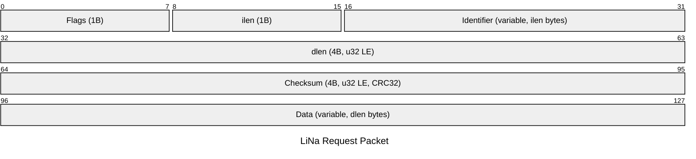
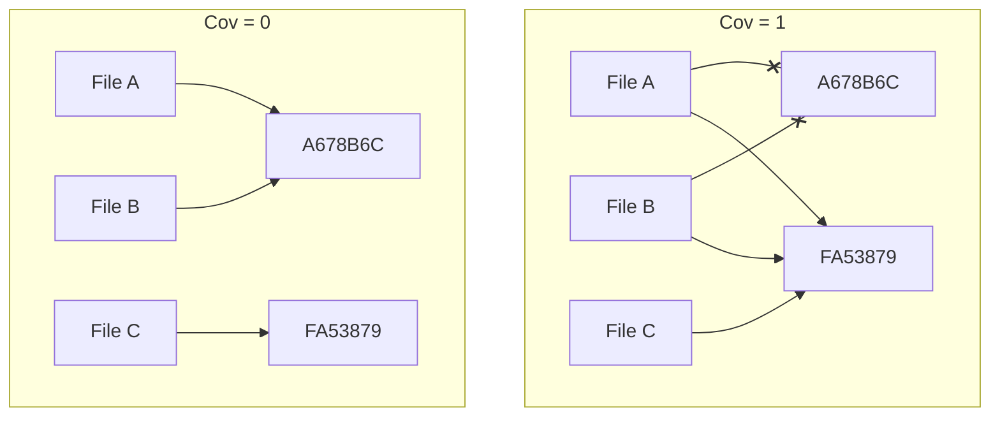

# ⭐ LiNa Store
A tiny ( less than 5 mb ), low-cost file storage service for linux.

## Features
### LiNa Store provides two applications:

- `linastore`: A simple local file storage service, which can deduplicate files and store them in a local directory. It can also support compression.

- `linastore-server`: The online version of LiNa Store. It accepts requests from two protocols: `HTTP` and `LiNa protocol`.

## Manual
### 1. Compile

LiNa Store offer a simple way to compile, you just need to run the following command:
```bash
git clone https://github.com/debugdoctor/linastore.git
cd linastore
cargo build --release
```
and then the binary file will be generated in `target/release`.

### 2. Send stream to LiNa Store server
LiNa protocol is a simple protocol, you can use any socket client to send stream to LiNa Store server.

The structure of LiNa protocol is as follows:


```mermaid
---
title: "LiNa Request Packet"
---
packet-beta
0-7:   "Flags (1B)"
8-15:  "ilen (1B)"
16-31: "Identifier (variable, ilen bytes)"
32-63: "dlen (4B, u32 LE)"
64-95: "Checksum (4B, u32 LE, CRC32)"
96-127: "Data (variable, dlen bytes)"
```

Wire layout (little-endian where applicable):

| Offset                 | Size            | Field        | Notes                                                                 |
|------------------------|-----------------|--------------|-----------------------------------------------------------------------|
| `0`                    | 1 byte          | `flags`      | See §2.1–2.4 below                                                    |
| `1`                    | 1 byte          | `ilen`       | Identifier length (0–255)                                             |
| `2 .. 2+ilen`          | `ilen` bytes    | `identifier` | Variable length; for file ops this is the file name, for `Auth` the username (no fixed padding) |
| `2+ilen .. 6+ilen`     | 4 bytes (LE)    | `dlen`       | Data length, capped by `LINASTORE_MAX_PAYLOAD_SIZE`                   |
| `6+ilen .. 10+ilen`    | 4 bytes (LE)    | `checksum`   | CRC32 of `ilen ‖ identifier ‖ dlen ‖ data`                            |
| `10+ilen .. 10+ilen+dlen` | `dlen` bytes | `data`       | Operation payload (see §2.5)                                          |

The server response uses the same `ilen`/`dlen`/`checksum` framing but replaces the leading `flags` byte with a `status` byte (see §3).

The first byte of LiNa packet is called "Flags", the specific meaning of each bit is as follows:

**2.1 File Operation Flags (`FO`)**

The top 3 bits of the flag byte (`flags & 0b1110_0000`) encode the operation. Decoding is done by exact match against the table below — any unassigned bit pattern is treated as `None`.

| Binary (bit 7..5) | Byte | Operation | Description                          |
|-------------------|------|-----------|--------------------------------------|
| `0b000`           | `0x00` | None    | No operation requested               |
| `0b010`           | `0x40` | Read    | Request to read a file               |
| `0b011`           | `0x60` | Auth    | Request authentication handshake     |
| `0b100`           | `0x80` | Write   | Request to write/create a file       |
| `0b110`           | `0xC0` | Delete  | Request to delete a file             |

> Earlier revisions of this document showed `FO` as a 2-bit field with `Delete` and `Auth` sharing the binary `0b11`. The wire byte values (`0x40`/`0x60`/`0x80`/`0xC0`) have always been distinct on bits 7–5 — clients that use the byte values shown above remain compatible.

**2.2 Cover Flags (`Cov`)**: the incoming data will overwrite the file which has the same data. Be careful to set this flag to `1` if you want keep the original file.


```mermaid
flowchart TD
    subgraph "Cov = 1"
        A2[File A] --x B2[A678B6C]
        C2[File B] --x B2
        D2[File C] --> E2[FA53879]
        A2 --> E2
        C2 --> E2
    end

    subgraph "Cov = 0"
        A[File A] --> B1[A678B6C]
        C[File B] --> B1
        D[File C] --> E[FA53879]
    end
```

**2.3 Compression Flag (`Com`)**: the new file will be compressed if this flag is set to `1`, if you want to compress the file and the file is already in the LiNa Store, plaease set `Cov` to `1` to compress it and overwrite the original file.

**2.4 Reserved bits (bit 4–2)**: currently unused. Clients MUST send these as `0`; servers MUST ignore non-zero values for forward compatibility. Future protocol revisions may use this field for a version tag or additional payload flags (e.g. explicit "encrypted payload" marker).

**2.5 Data field semantics**

| Operation        | `identifier`         | `data`                                                                 |
|------------------|----------------------|------------------------------------------------------------------------|
| `Auth` (0x60)    | Username             | Password (null-terminated optional)                                    |
| `Write` (0x80)   | File name            | `session_token + '\0' + (AES-256-GCM(nonce ‖ ciphertext))` when authenticated; raw file bytes when auth is disabled |
| `Read` (0x40)    | File name            | `session_token` (null-terminated optional) when authenticated; empty when auth is disabled |
| `Delete` (0xC0)  | File name            | `session_token` (null-terminated optional) when authenticated; empty when auth is disabled |

The session token is returned by the `Auth` handshake. AES-GCM encryption uses `SHA256(session_token)` as the key and a 12-byte nonce prefix in `data`.

A successful `Auth` response carries `data = status(1 byte) + token + '\0' + expires_at_seconds_ascii`. See §3 for status codes.

## Authentication

LiNa Store supports password-based authentication for securing access to the storage service.

When authentication is enabled via the `LINASTORE_AUTH_REQUIRED` environment variable, the advanced service requires a valid session token on file operations.

### Authentication Flow

1. **Handshake (Authentication)**: Client sends username and password to authenticate
2. **Session Token**: Server returns a session token and expiration time
3. **Subsequent Operations**: Client includes session token in requests for encryption and authorization

### Handshake Protocol

To authenticate, send a handshake request with the following structure:

- **Flags**: `0b11` (Auth)
- **Identifier**: Username (null-terminated string, max 255 bytes)
- **Data**: Password (null-terminated string)

**Response** (on success):
- **Status**: `0x00` (Success)
- **Data**: `status(1) + token + '\0' + expires_at`
  - `status`: `0x00` (Success)
  - `token`: Session token (UUID string)
  - `expires_at`: Unix timestamp when token expires (1 hour from handshake)

**Response** (on failure):
- **Status**: Error code (`0x04` = Unauthorized, `0x05` = Bad Request, `0x7f` = Internal Error)
- **Data**: Error status byte (1 = Invalid Password, 2 = Auth Disabled, 127 = Internal Error)

### Using Session Tokens

After successful handshake, clients should:
1. Store the session token
2. Include the session token in subsequent file operations
3. Encrypt file data using the session token (AES-256-GCM)
4. Handle token expiration (re-authenticate when expired)

### Client Libraries

All official client libraries support authentication:

- **Python**: [`lina_client.py`](client/python/lina_client.py) - Use `client.handshake(username, password)`
- **Java**: [`LiNaStoreClient.java`](client/java/src/main/java/com/aimerick/linastore/LiNaStoreClient.java) - Use `client.handshake(username, password)`
- **C**: [`linaclient.h`](client/c/src/linaclient.h) - Use `handshake(client, username, password)` (requires OpenSSL for AES-256-GCM)
- **C++**: [`linaclient.h`](client/cpp/src/linaclient.h) - Use `client.handshake(username, password)` (requires OpenSSL for AES-256-GCM)

### Example Usage

#### Python
```python
from lina_client import LiNaStoreClient

client = LiNaStoreClient("localhost", 8096)
result = client.handshake("admin", "password123")
print(f"Token: {result[0]}, Expires: {result[1]}")

# Set session token for subsequent operations
client.set_session_token(result[0])

# Upload file with authentication
with open("file.txt", "rb") as f:
    client.upload_file("myfile.txt", f)
```

#### Java
```java
LiNaStoreClient client = new LiNaStoreClient("localhost", 8096);
HandshakeResult result = client.handshake("admin", "password123");
System.out.println("Token: " + result.getToken());
System.out.println("Expires at: " + result.getExpiresAt());

// Set session token for subsequent operations
// (automatically set by handshake method)

// Upload file with authentication
byte[] data = "Hello, LiNaStore!".getBytes();
client.uploadFile("myfile.txt", data, LiNaFlags.WRITE.getValue());
```

#### C
```c
#include "linaclient.h"

LiNaClient client = create_client("localhost", 8096);
HandshakeResult result = handshake(&client, "admin", "password123");
printf("Token: %s\n", result.token);
printf("Expires at: %lu\n", result.expires_at);

// Use session token for subsequent operations
// (token is available in result.token)

// Upload file with authentication
char* data = "Hello, LiNaStore!";
uploadFile(&client, "myfile.txt", data, strlen(data), LINA_WRITE);
```

#### C++
```cpp
#include "linaclient.h"

LiNaClient client("localhost", 8096);
HandshakeResult result = client.handshake("admin", "password123");
std::cout << "Token: " << result.token << std::endl;
std::cout << "Expires at: " << result.expires_at << std::endl;

// Session token is automatically set by handshake method

// Upload file with authentication
std::vector<char> data = {'H', 'e', 'l', 'l', 'o', ',', ' ', 'L', 'i', 'N', 'a', 'S', 't', 'o', 'r', 'e', '!'};
client.uploadFile("myfile.txt", data, LiNaClient::LINA_WRITE);
```

### Server Configuration

To enable authentication on the server:

1. Set `LINASTORE_AUTH_REQUIRED=1` environment variable
2. Set `LINASTORE_ADMIN_PASSWORD` to provide the admin password
3. The server will create an admin user automatically on startup

`LINASTORE_ADMIN_USER` is optional and defaults to `admin`.

**Note**: When authentication is disabled, the server operates in open access mode and no authentication is required. When authentication is enabled, the server now refuses to start unless a password is provided explicitly.
