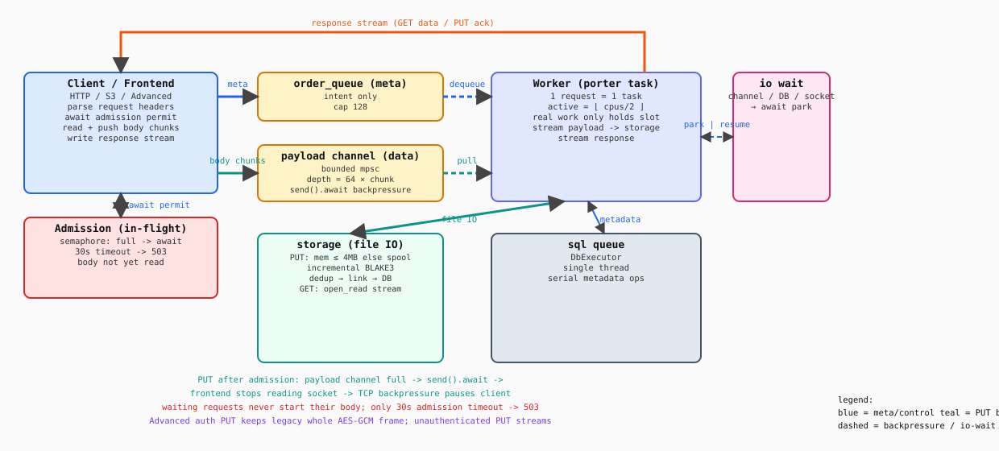

# LiNaStore 架构

## 架构图



> SVG 由 `docs/draw_architecture.py`（纯标准库）生成，改图后运行 `python3 docs/draw_architecture.py` 重新生成。

## 核心思路

- **元数据（SQLite）单线程**：所有 DB 访问经 `sql queue`（`DbExecutor` actor）串行消费，多步元数据操作天然原子。
- **对象文件 IO 并行**：blob 读写删走系统调用，应用层无锁。
- **流式进出、不整块缓冲**：HTTP/S3 和 Advanced 未认证 PUT 只放 meta，实体经有界通道流式进出；上传按大小走内存或临时文件，读取逐块解压 + 增量校验。Advanced 认证 PUT 继续兼容旧的整体 AES-GCM 帧格式，因此仍需暂存密文。
- **在途与活跃解耦**：请求在等网络/流式/DB 时只占在途配额（io wait），不占活跃 worker 槽。
- **满载时等待而不是中途拒绝**：in-flight 满时，请求在 admission 阶段等待 permit；PUT body 尚未开始读取，客户端会被 TCP/HTTP 背压暂停。只有等待超过 30 秒才返回 503。

## 三层并发控制

| 配额 | 默认 | 说明 |
|------|------|------|
| `req queue` | `= in_flight` | 只放 meta 的 mpsc；容量跟随 `in_flight` |
| `in_flight` 信号量 | `256` | 在途请求上限（含挂起等待）；满时异步等待，`LINASTORE_IN_FLIGHT` 可配 |
| `active` 信号量 | `floor(CPU核数 / 2)` | 同时真正干活的请求数（1:1），`LINASTORE_PORTER_CONCURRENCY` 可配 |
| SQL 队列 | 单线程 | `DbExecutor` 唯一持有 SQLite，串行消费 |

> 默认 `active = floor(逻辑核数 / 2)`，`in_flight = 256`（面向 IO/网络型负载）。在途任务只是挂在 IO 上（便宜），所以 `in_flight` 远大于活跃槽，用来吸收并发慢连接；真正干活的并发数 `active` 才受 CPU 数约束。`in_flight` 上限约等于可同时挂起的请求数，请配合较小的 `channel_depth`（默认 16）控制最坏内存。超过 admission 等待上限才返回 503，不会丢弃已入队请求。

## 上传路径（put_stream）

```
chunk 流 ──► 已知长度 ≤4MB？──► 内存缓冲（避免临时文件 IO）
        └──► 大 / 未知 ──► 临时文件 spool（按 63KB 块压缩）
                        ──► 增量 BLAKE3 hash
                        ──► 写文件前先查重（dedup_or_link）
                              ├─ 命中：只加 link（引用计数 +1），不保留文件
                              └─ 未命中：落盘 → put_meta 提交新 source
```

- 小文件（≤4MB，`INLINE_MEMORY_THRESHOLD`）：整段内存缓冲，哈希后先查重，命中则**连磁盘都不写**。
- 大文件/未知长度：边收边写临时文件（按块压缩），内存恒定为「64 个 chunk 的通道缓冲 + 63KB 块」。payload channel 满时，frontend 的 `send().await` 阻塞，停止读取 socket，背压回客户端。
- 去重按内容哈希 + 压缩标志；命中已有 source 就合并（加 link、引用计数 +1），提升空间利用率。

## 读路径（get / stream_get_response）

- `StoreManager::open_read`：逐块解压 + 增量 BLAKE3 校验（EOF 校验失败即拒绝）。
- HTTP/S3：单遍真流式，Content-Length 来自元数据 size，`StreamBody` 写 socket。
- Advanced（LiNa 协议）：未认证 PUT 先解析 header，再等待 admission，随后按 64KB 流式读 body 并增量校验 CRC；认证 PUT 仍先读完整兼容帧。响应头带 CRC32，先流式预扫算 CRC + 校验，再流式发数据。读全程不占活跃槽（只有预扫占）。

## 关键组件

| 组件 | 位置 | 职责 |
|------|------|------|
| ConveyQueue | `linastore-server/src/conveyer.rs` | 一条 order mpsc + `in_flight` 许可；响应通道 `reply` 内嵌在 order 里 |
| Porter | `linastore-server/src/porter.rs` | 每请求一 task；`active` 信号量（`in_flight` 由前端自持许可） |
| DbExecutor | `linabase/src/dbexec.rs` | SQLite 单线程 actor（sql queue） |
| StoreManager | `linabase/src/service.rs` | 并发对象存储；`put_stream`/`open_read` 流式 IO + 去重 |
| ResponseStream | `linastore-server/src/dtos.rs` | 流式响应（status/长度/CRC 头 + 有界数据通道） |

## 数据流

- 写：`user ─► admission（满则等待）─► req queue ─► task（收 payload：内存/spool，不占活跃槽）─► 查重/落盘/DB ─► 响应`
- 读：`user ─► req queue ─► task（预扫 CRC/校验）─► 流式响应（不占活跃槽）─► user`
